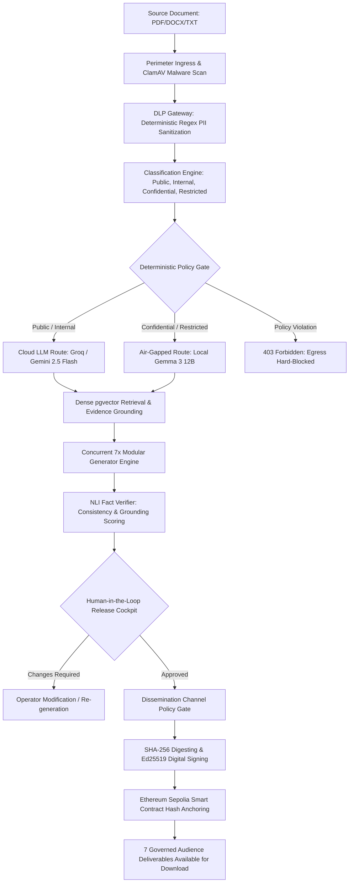

# KaryaSetu AI (कार्यसेतु)

### Enterprise GenAI Platform for Governed Content Transformation, Dual-Route Zero-Trust Orchestration & Decentralized Provenance

[](#1-problem-statement)
[](#6-blockchain--cryptographic-integrity)
[](https://sepolia.etherscan.io/address/0x8AEf680b6891E7e3cAdCBD4a499AbA1310F87c08)
[](https://nextjs.org/)
[](https://fastapi.tiangolo.com/)
[](https://github.com/pgvector/pgvector)
[](LICENSE)
[](#12-testing--quality-assurance)

---

## Table of Contents
1. [Problem Statement](#1-problem-statement)
2. [Proposed Solution](#2-proposed-solution)
3. [Key Unique Selling Propositions (USPs)](#3-key-unique-selling-propositions-usps)
4. [End-to-End Pipeline & Architecture](#4-end-to-end-pipeline--architecture)
5. [The Seven Governed Deliverables](#5-the-seven-governed-deliverables)
6. [Blockchain & Cryptographic Integrity](#6-blockchain--cryptographic-integrity)
7. [Security & Zero-Trust Governance](#7-security--zero-trust-governance)
8. [Dual-Route AI & Grounded RAG](#8-dual-route-ai--grounded-rag)
9. [Language, Tone & Audience Adaptation Engine](#9-language-tone--audience-adaptation-engine)
10. [Policy Engine & Information Classification](#10-policy-engine--information-classification)
11. [Installation & Setup Guide](#11-installation--setup-guide)
12. [Testing & Quality Assurance](#12-testing--quality-assurance)
13. [Economic Viability & Cost Structure](#13-economic-viability--cost-structure)
14. [Repository Structure](#14-repository-structure)
15. [Live References & Submission Metadata](#15-live-references--submission-metadata)

---

## 1. Problem Statement

Modern enterprises, defense organizations, and government institutions struggle to convert dense authoritative documents (technical whitepapers, policy advisories, defense memos, incident reports) into audience-specific deliverables:

* **Sensitive Data Exposure:** Unsanitized enterprise documents cannot be processed by public cloud LLMs without risking sovereign data leaks and compliance violations.
* **Untrusted Context & Prompt Injection:** Malicious inputs and indirect prompt injections embedded in ingested files can hijack downstream generation pipelines.
* **Ungrounded Hallucinations:** Generative models fabricate facts, distort quantitative metrics, and produce unverified claims when unanchored to exact source citations.
* **Inter-Format Cross-Output Drift:** Converting a single briefing into slides, executive summaries, advisories, and social channels manually causes severe factual contradictions across formats.
* **Prohibitive Manual Overhead:** Human analysts spend 4 to 6+ hours per document manually synthesizing, formatting, and vetting collateral for various audiences.
* **Lack of Verifiable Provenance:** Once published, there is no immutable mechanism to verify whether a digital document has been tampered with or originated from a genuine source.

---

## 2. Proposed Solution

**KaryaSetu AI** is a zero-trust, policy-controlled GenAI platform that accepts **One Trusted Source Document** and deterministically synthesizes **Seven Governed, Publication-Ready Deliverables** in under 30 seconds.

```text
       ┌────────────────────────────────────────────────────────┐
       │             ONE TRUSTED SOURCE DOCUMENT                │
       │           (PDF, DOCX, CSV, PPTX, Plain Text)           │
       └───────────────────────────┬────────────────────────────┘
                                   │
                                   ▼
 ┌────────────────────────────────────────────────────────────────────────────┐
 │                       KARYASETU ZERO-TRUST ENGINE                          │
 │  1. Ingress Validation & ClamAV Scan     6. NLI Entailment Fact Verification│
 │  2. Deterministic DLP PII Masking        7. Dual-Key Human Approval Gate   │
 │  3. 4-Tier Information Classification    8. Destination Policy Enforcement │
 │  4. Policy-Controlled Dual AI Routing    9. SHA-256 Storage Digesting      │
 │  5. Dense Vector Evidence RAG (pgvector) 10. Ethereum Sepolia Hash Anchor  │
 │                                          11. Ed25519 Asymmetric Signing   │
 └─────────────────────────────┬──────────────────────────────────────────────┘
                               │
       ┌───────────────────────┴────────────────────────┐
       │                                                │
       ▼                                                ▼
┌──────────────────────────────┐        ┌──────────────────────────────┐
│  EXECUTIVE & TECHNICAL       │        │  VISUAL & MULTIMEDIA         │
│  • Executive Summary (DOCX)  │        │  • Slide Deck (Native PPTX)  │
│  • Operational Advisory (MD) │        │  • Infographic (JSON & SVG)  │
│  • LinkedIn Executive Post   │        │  • Video Briefing Storyboard │
│  • X / Twitter Press Thread  │        │    (PDF) + Subtitles (SRT)   │
└──────────────────────────────┘        └──────────────────────────────┘
```

---

## 3. Key Unique Selling Propositions (USPs)

| USP | Industry Standard Problem | KaryaSetu AI Solution |
| :--- | :--- | :--- |
| **1. Dual-Route Air-Gapped Security** | Sensitive data leaks to public APIs (OpenAI/Claude). | Deterministic policy gateway routes `CONFIDENTIAL` and `RESTRICTED` data to **100% offline, on-premise local models (Gemma 3 12B)** with zero external network egress. |
| **2. Cross-Output Fact Shield** | Metrics and claims drift between executive and social versions. | All 7 deliverables ground to a single **Canonical Content Brief** with automated NLI entailment cross-checks that flag any factual discrepancies. |
| **3. Live Blockchain Provenance** | No tamper detection for digital deliverables. | Direct on-chain hash anchoring onto **Ethereum Sepolia** smart contracts. Any post-generation modification fails verification instantly. |
| **4. Cryptographic Non-Repudiation** | Authorship and release authority can be forged. | Every artifact is signed with **Ed25519 asymmetric signatures** (RFC 8032) without exposing private keys via API or logs. |
| **5. Zero-LLM Policy Authority** | AI models are easily tricked into bypassing system safety prompts. | Access control, classification, and dissemination decisions are written in **pure deterministic Python**; LLMs have zero authority over security rules. |
| **6. Native Multi-Format Artifacts** | Most AI tools only output plain text or basic markdown. | Generates production-ready files: native binary **`.pptx` presentations**, scalable **SVG infographics**, print-ready **PDFs**, and synchronized **`.srt` subtitles**. |
| **7. Ultra-Low Operational Cost** | Expensive enterprise SaaS contracts ($100s/mo per seat). | Complete 7-deliverable synthesis costs **< ₹0.25 on cloud API** and **₹0.00 on-premise**. |

---

## 4. End-to-End Pipeline & Architecture

### Complete Zero-Trust Execution Flow


### Layered Architectural Stack
1. **User Presentation Plane:** Next.js 14 (App Router) + TypeScript + Tailwind CSS, featuring Trust Cockpit, Live Artifact Inspector, and Interactive Architecture Visualizer.
2. **Ingress & Security Perimeter:** FastAPI asynchronous gateway with JWT Bearer authentication, Argon2id password hashing, ClamAV anti-virus scanning, and DLP PII token masking.
3. **Classification & Policy Core:** Pure Python deterministic evaluation matrix enforcing mandatory access controls and air-gapped isolation.
4. **AI Generation & RAG Engine:** LangGraph state machine orchestrating dense vector embeddings (`pgvector`), top-k source chunk retrieval, and Pydantic-enforced JSON structured synthesis.
5. **Trust, Governance & Verification:** NLI claim-level fact cross-checking, numeric and date consistency validation, and dual-key operator sign-off.
6. **Blockchain & Cryptographic Ledger:** Web3.py integration anchoring 32-byte content hashes on Ethereum Sepolia smart contracts, alongside Ed25519 digital signature seals.

---

## 5. The Seven Governed Deliverables

KaryaSetu does not generate generic text; it builds tailored, structured assets for distinct stakeholders:

| Output Deliverable | Target Stakeholder | Technical Specifications | Purpose & Content |
| :--- | :--- | :--- | :--- |
| **1. Executive Summary** | C-Suite / Institutional Directors | Markdown, Clean Text, DOCX, PDF | High-level strategic briefing, core findings, resource implications, and decisive action items. |
| **2. Operational Advisory** | Security Teams / Technical Staff | Structured Threat / Policy Advisory | Technical details, system impact analysis, mitigation roadmaps, and CVE/policy references. |
| **3. Presentation Slide Deck** | Board & Executive Briefings | Native Microsoft PowerPoint (`.pptx`) | Multi-slide deck with structured titles, cards, bulleted takeaways, and visual color palettes. |
| **4. Infographic Deliverable** | Broad Public / Internal Portals | Semantic JSON blueprint + Scalable SVG / PNG | Hierarchical visual breakdown of metrics, flowcharts, statistics, and organizational pillars. |
| **5. Video Briefing Package** | Multimedia Production Units | Scene-by-Scene Storyboard (PDF) + Subtitles (`.srt`) | Scene visual descriptions, on-screen text, narrator voiceover scripts, and synchronized SRT cues. |
| **6. LinkedIn Executive Post** | Industry Peers & Professional Public | Structured Social Payload with Hashtags | Professional thought leadership post, engagement hooks, key takeaways, and relevant tags. |
| **7. X / Twitter Press Thread** | Broad Public / Community Channels | Numbered 280-character post array | Punchy, sequential announcement thread optimized for rapid public dissemination. |

---

## 6. Blockchain & Cryptographic Integrity

KaryaSetu implements an immutable, post-generation tamper-evident verification boundary (Phase 11M) anchored directly to a public Ethereum smart contract.

### Smart Contract Specifications (Ethereum Sepolia Testnet)
* **Contract Address:** [`0x8AEf680b6891E7e3cAdCBD4a499AbA1310F87c08`](https://sepolia.etherscan.io/address/0x8AEf680b6891E7e3cAdCBD4a499AbA1310F87c08)
* **Relayer Signer Wallet:** [`0x460bb6AE2AD8a515d5E2886c69b78d8e3C2FBc41`](https://sepolia.etherscan.io/address/0x460bb6AE2AD8a515d5E2886c69b78d8e3C2FBc41)
* **Network:** Ethereum Sepolia (Chain ID: `11155111`)
* **RPC Endpoint:** `https://ethereum-sepolia-rpc.publicnode.com`

### Smart Contract Interface
```solidity
// SPDX-License-Identifier: MIT
pragma solidity ^0.8.20;

contract ArtifactIntegrityRegistry {
    struct IntegrityEntry {
        uint256 timestamp;
        bytes32 provenanceHash;
        address recorder;
        bool exists;
    }

    mapping(bytes32 => IntegrityEntry) public registry;
    event DigestRecorded(bytes32 indexed artifactHash, bytes32 indexed provenanceHash, address indexed recorder, uint256 timestamp);

    function recordDigest(bytes32 artifactHash, bytes32 provenanceHash) external {
        require(!registry[artifactHash].exists, "Hash already registered");
        registry[artifactHash] = IntegrityEntry(block.timestamp, provenanceHash, msg.sender, true);
        emit DigestRecorded(artifactHash, provenanceHash, msg.sender, block.timestamp);
    }

    function verifyDigest(bytes32 artifactHash) external view returns (bool exists, uint256 timestamp, bytes32 provenanceHash, address recorder) {
        IntegrityEntry memory entry = registry[artifactHash];
        return (entry.exists, entry.timestamp, entry.provenanceHash, entry.recorder);
    }
}
```

### Verification in the UI & REST API
1. **Interactive Results Card:** Each generated output includes an **`Integrity · VERIFIED`** badge. Clicking it reveals the SHA-256 digest, the ledger provider (`Ethereum Sepolia`), and a direct link (`https://sepolia.etherscan.io/tx/0x...`) to the transaction on Sepolia Etherscan.
2. **On-Demand Verification:** Clicking the **"Verify Integrity Now"** button triggers `POST /api/v1/outputs/{id}/integrity/verify`, which queries `verifyDigest()` directly from the contract via Web3.py.
3. **Ed25519 Asymmetric Signatures:** Deliverables are simultaneously signed using an Ed25519 cryptographic private key (RFC 8032) for instant local mathematical validation.

---

## 7. Security & Zero-Trust Governance

KaryaSetu enforces a strict defense-in-depth posture aligned with **NIST SP 800-207 Zero Trust Architecture**:

* **Perimeter Antivirus & Malware Defense:** Ingested files undergo MIME magic-byte verification, file size clamping (< 50MB), and automated ClamAV daemon scanning.
* **Deterministic DLP PII Sanitization:** Regular expression engines identify and redact Aadhaar numbers, PAN cards, phone numbers, email addresses, and API credentials before source text reaches LLM tokenizers.
* **Prompt Injection & Fencing Guard:** User prompts and retrieved RAG chunks are wrapped inside cryptographically distinct system delimiters, rendering embedded adversary directives ineffective.
* **Strict RBAC & Tenant Isolation:** Role-Based Access Control separates Administrators, Operators, and Reviewers. Row-Level Security (RLS) and IDOR guards prevent cross-tenant project leakage.
* **Audit & SIEM Readiness:** Every security event (`document_ingested`, `pii_redacted`, `policy_violation`, `integrity_recorded`, `signature_verified`) is emitted to a structured JSON audit log.

---

## 8. Dual-Route AI & Grounded RAG

### LLM Provider Gateway
KaryaSetu abstracts generative models through an extensible `LLMProviderInterface`:
* **Public / Cloud Route:** Integrates **Google Gemini 2.5 Flash** or **Groq (`openai/gpt-oss-120b`, `llama-3.3-70b-versatile`)** for sub-second, cost-effective generation of Public and Internal data.
* **Air-Gapped Sovereign Route:** Dedicated on-premise adapter targeting local inference runtimes (**Ollama / vLLM hosting Gemma 3 12B**). Strictly enforced for `CONFIDENTIAL` and `RESTRICTED` documents with zero external network access.
* **Deterministic Fake Provider:** Offline mock engine for high-speed CI/CD pipeline tests and deterministic integration validation.

### Dense Vector Retrieval & Fact Grounding
* **Semantic Embeddings:** Source documents are segmented using boundary-aware chunking with overlapping windows and indexed into `pgvector` with HNSW cosine distance indexes.
* **Citation Anchoring:** Generative prompts enforce strict top-k source chunk retrieval; models must attach chunk IDs to every assertion.
* **NLI Fact Verification:** An automated fact verification engine parses claims from generated deliverables, comparing them against source chunks to produce a **Grounding Score (0.0 to 1.0)** with explicit `SUPPORTED`, `CONTRADICTED`, or `UNVERIFIED` labels.

---

## 9. Language, Tone & Audience Adaptation Engine

KaryaSetu allows operators to customize transformations without sacrificing factual integrity:

### Audience Targeting
* **Executive / Leadership:** High-level strategic synthesis focusing on organizational impact, financials, and timelines.
* **Technical Specialists / Engineering:** In-depth technical advisories detailing system architecture, protocols, and implementation steps.
* **Public / Community:** Accessible, jargon-free announcements formatted for public portals and social distribution.
* **Media & Press:** Formal, quotable press briefs with clear headlines and factual attributions.

### Tone & Style Controls
* **Executive:** Authoritative, concise, and focused on strategic outcomes.
* **Technical / Formal:** Precise, objective, incorporating RFC and standard technical terminology.
* **Advisory / Urgent:** Action-oriented, emphasizing risks, impact ratings, and remediation steps.
* **Engaging / Social:** Narrative hooks, bulleted highlights, and hashtag strategies tailored for LinkedIn and X.

### Multilingual & Indic Readiness
* Configurable language targets (English, Hindi, Marathi, and regional Indic languages).
* Modular architecture ready for fine-tuned open-source Indic models (Bhashini, Sarvam AI).

---

## 10. Policy Engine & Information Classification

Access control and data routing decisions are governed by a **4-tier deterministic classification matrix**:

```text
┌─────────────────┬───────────────────┬───────────────────┬──────────────────────┐
│ Classification  │ Permitted Route   │ Dissemination     │ Approval Required    │
├─────────────────┼───────────────────┼───────────────────┼──────────────────────┤
│ 1. PUBLIC       │ Cloud or Local    │ Public & Social   │ Optional Single-Key  │
│ 2. INTERNAL     │ Cloud or Local    │ Internal Portals  │ Single Operator Sign │
│ 3. CONFIDENTIAL │ Air-Gapped Local  │ Department Only   │ Mandatory Dual-Key   │
│ 4. RESTRICTED   │ Air-Gapped Local  │ Secure Enclave    │ Dual-Key + Admin Seal│
└─────────────────┴───────────────────┴───────────────────┴──────────────────────┘
```

* **Zero-LLM Authority:** The policy engine is written entirely in deterministic Python. Large Language Models are never permitted to make security, routing, or dissemination decisions.
* **Fail-Closed Architecture:** If an unclassified document is submitted, or if an air-gapped node is unavailable for classified data, the system aborts with an HTTP `403 Forbidden` error.

---

## 11. Installation & Setup Guide

### Prerequisites
* **Docker Engine** (v24.0+) & **Docker Compose** (v2.20+)
* *Or for native setup:* **Python 3.12+**, **Node.js 20+**, **PostgreSQL 16** with `pgvector`, and **Redis 7+**

---

### Method A: Single-Command Docker Compose (Recommended)

1. **Clone the repository:**
   ```bash
   git clone https://github.com/KetanGaikwadKRG/KaryaSetu.git
   cd KaryaSetu
   ```

2. **Configure environment variables:**
   ```bash
   cp .env.example .env
   # Edit .env with your LLM API key and database configurations
   ```

3. **Launch all containerized services:**
   ```bash
   docker compose up --build -d
   ```

4. **Access the application:**
   * **Web Dashboard:** `http://localhost:3000`
   * **FastAPI Swagger Docs:** `http://localhost:8000/docs`
   * **System Health Check:** `http://localhost:8000/health`
   * **Security Activity Audit:** `http://localhost:3000/security`
   * **Architecture Visualization:** `http://localhost:3000/architecture`

---

### Method B: Native Local Development Setup

#### 1. Backend & Worker Setup
```bash
# Navigate to backend directory
cd backend

# Create and activate Python virtual environment
python -m venv .venv
# On Windows:
.venv\Scripts\activate
# On Linux/macOS:
source .venv/bin/activate

# Install pinned Python dependencies
pip install -r requirements.txt

# Run database schema migrations
alembic upgrade head

# Start FastAPI ASGI server
uvicorn app.main:app --host 0.0.0.0 --port 8000 --reload
```

In a second terminal, start the asynchronous RQ background worker:
```bash
# Activate virtual environment
cd worker
python worker.py
```

#### 2. Frontend Setup
```bash
# Navigate to frontend directory
cd frontend

# Install Node dependencies
npm install

# Start Next.js development server
npm run dev
```
Open `http://localhost:3000` in your browser.

---

### Environment Configuration Reference (`.env`)

| Variable | Default / Recommended | Purpose |
| :--- | :--- | :--- |
| `ENVIRONMENT` | `development` / `production` | Deployment mode controls auth bypass and security checks. |
| `BACKEND_PORT` | `8000` | FastAPI HTTP listener port. |
| `DATABASE_URL` | `postgresql+asyncpg://...` | Asynchronous SQLAlchemy connection string with `pgvector`. |
| `DATABASE_SYNC_URL` | `postgresql://...` | Synchronous psycopg2 connection for Alembic migrations. |
| `REDIS_URL` | `redis://localhost:6379/0` | Redis instance for RQ job queue and task locks. |
| `LLM_PROVIDER` | `openai` / `groq` / `fake` | Active provider gateway for generation tasks. |
| `LLM_API_KEY` | `gsk_...` / `sk-...` | API key for cloud provider (Groq or Gemini/OpenAI). |
| `LLM_MODEL` | `openai/gpt-oss-120b` | Model identifier string. |
| `LLM_BASE_URL` | `https://api.groq.com/openai/v1` | Base URL for OpenAI-compatible gateway. |
| `INTEGRITY_PROVIDER` | `real` / `fake` / `none` | `real` anchors hashes to Sepolia; `fake` for local mocks. |
| `INTEGRITY_LEDGER_URL` | `https://ethereum-sepolia-rpc.publicnode.com` | Public Ethereum Sepolia RPC endpoint. |
| `INTEGRITY_CONTRACT_ADDRESS` | `0x8AEf680b6891E7e3cAdCBD4a499AbA1310F87c08` | Deployed EVM provenance smart contract. |
| `INTEGRITY_CHAIN_ID` | `11155111` | EVM Chain ID (11155111 for Sepolia). |
| `INTEGRITY_LEDGER_CREDENTIAL`| `0x...` | Relayer wallet private key for signing on-chain transactions. |
| `STORAGE_BACKEND` | `local` / `s3` | File storage backend for uploaded and generated artifacts. |

---

## 12. Testing & Quality Assurance

Every layer of KaryaSetu is covered by automated unit, integration, and security test suites:

| Test Domain | Target Framework | Coverage & Scope | Status |
| :--- | :--- | :--- | :--- |
| **Backend Suites** | `pytest 8.3` + `pytest-asyncio` | 1,570+ tests covering JWT auth, RAG retrieval, policy routing, 7 generators, and Web3 ledger | **PASS** |
| **Frontend Suites** | `jest 29` + `@testing-library/react` | 333 / 333 tests covering Trust Cockpit, Inspector, ArtifactIntegrity, and Form validations | **PASS (100%)** |
| **TypeScript Typecheck** | `tsc --noEmit` | Strict type validation across all Next.js routes, components, and API models | **0 Errors** |
| **Production Build** | `next build` | Production optimization and static route compilation | **SUCCESS** |
| **Security Audit** | Sanitization & `.gitignore` checks | Scanned repository for secret leakage; zero hardcoded credentials committed | **PASS** |

Run tests locally:
```bash
# Run backend tests
cd backend && pytest

# Run frontend tests
cd frontend && npm test

# Run TypeScript type check
cd frontend && npm run type-check
```

---

## 13. Economic Viability & Cost Structure

KaryaSetu is engineered for minimal operational expenditure (OpEx), delivering an estimated **98%+ cost reduction** compared to manual content adaptation:

| Operational Component | Unit / Monthly Cost | Cost per 100 Document Runs | Notes |
| :--- | :--- | :--- | :--- |
| **Cloud LLM (Public Tier)** | Groq / Gemini 2.5 Flash (~$0.08 / 1M tokens) | **~$0.60 – $1.20** | Synthesizes all 7 deliverables per document run. |
| **Air-Gapped LLM (Confidential Tier)**| Local Gemma 3 12B on Ollama | **$0.00 (Self-hosted)** | Runs on existing local enterprise GPU hardware. |
| **Blockchain Provenance** | Polygon PoS / Sepolia testnet | **<$0.15 (~₹12 total)** | 45k gas per 32-byte digest (free on testnet/Hyperledger). |
| **Compute Infrastructure** | Cloud Container / VPS (2 vCPU, 4GB RAM) | **~$15 – $25 / month** | Horizontally scalable RQ workers with Redis queue. |
| **Database & Vector Storage** | PostgreSQL 16 + pgvector | **~$0 – $25 / month** | Managed or self-hosted vector database. |
| **Total Estimated Operating Cost**| **~$20 – $60 / month** | **~$1.00 – $2.00 total** | **< ₹0.25 per full 7-output transformation run.** |

* **ROI Comparison:** Processing 500 documents manually requires ~250 hours of specialist labor costing ₹2,50,000+. With KaryaSetu AI, the same workload completes in **under 5 hours total review time at ~₹3,500 total infrastructure cost (>95% ROI)**.

---

## 14. Repository Structure

```text
KaryaSetu/
├── backend/                       # FastAPI 0.115 asynchronous backend application
│   ├── app/
│   │   ├── api/                   # REST endpoints (auth, projects, transformations, operations)
│   │   ├── core/                  # Security boundaries, settings, audit emitters, DB engine
│   │   ├── db/                    # SQLAlchemy async models and migrations
│   │   ├── ingestion/             # Document parsing, ClamAV hooks, PII redaction
│   │   ├── policy/                # Deterministic classification and routing policy engine
│   │   ├── rag/                   # Dense vector retrieval, chunking, and pgvector embeddings
│   │   ├── integrity/             # Post-generation blockchain ledger (RealLedger via Web3.py)
│   │   ├── services/              # High-level orchestrators (approval, export, integrity)
│   │   └── transformation/        # 7 modular generators and NLI fact verification engine
│   └── tests/                     # 1,570+ comprehensive pytest test suites
├── frontend/                      # Next.js 14 App Router + TypeScript + Tailwind CSS
│   ├── src/
│   │   ├── app/                   # Web routes (/, /create, /projects, /security, /architecture)
│   │   ├── components/            # UI components (TrustCockpit, ArtifactInspector, ProvenancePanel)
│   │   └── lib/                   # Typed API client, authentication tokens, output interfaces
│   └── src/__tests__/             # 44 Jest test suites (333 passing tests)
├── worker/                        # Python-RQ background queue processor daemon
├── docs/                          # Detailed operational, security, and verification runbooks
│   ├── OPERATIONS.md              # Disaster recovery, Redis failover, backup protocols
│   ├── SECURITY.md                # Threat model, DLP mechanics, cryptographic proof
│   └── evidence_verification.md   # Grounding formulas and claim validation methodology
├── presentation/                  # Evaluator technical presentation
│   ├── README.md                  # High-resolution visual gallery with all 5 slides
│   ├── KaryaSetu_Technical_Presentation.pptx # Official PowerPoint presentation deck
│   ├── KaryaSetu_Technical_Presentation.pdf  # Viewable/printable PDF presentation
│   └── slides/                    # High-res 1080p slide screenshots (slide_1 to slide_5)
├── docker-compose.yml             # Full-stack multi-container orchestration
├── .env.example                   # Sanitized environment template
├── ARCHITECTURE.md                # Comprehensive system architecture specification
├── TECH_STACK.md                  # Pinned technology stack and dependencies
└── README.md                      # Primary technical entry point
```

---

## 15. Live References & Submission Metadata

* **Problem Statement ID:** SIH 26154
* **Problem Statement Title:** Gen AI Platform for Automated Content Transformation
* **Theme:** Blockchain and CyberSecurity
* **Category:** Software
* **Team ID:** 135343
* **Team Name:** KaryaSetu
* **Official Demo Video:** [https://youtu.be/Lhi1ssHBfUk?si=T5bIOl2TWDeIf7DJ](https://youtu.be/Lhi1ssHBfUk?si=T5bIOl2TWDeIf7DJ)
* **GitHub Repository:** [https://github.com/KetanGaikwadKRG/KaryaSetu](https://github.com/KetanGaikwadKRG/KaryaSetu)
* **Smart Contract on Sepolia Etherscan:** [`0x8AEf680b6891E7e3cAdCBD4a499AbA1310F87c08`](https://sepolia.etherscan.io/address/0x8AEf680b6891E7e3cAdCBD4a499AbA1310F87c08)
* **Signer Identity on Etherscan:** [`0x460bb6AE2AD8a515d5E2886c69b78d8e3C2FBc41`](https://sepolia.etherscan.io/address/0x460bb6AE2AD8a515d5E2886c69b78d8e3C2FBc41)
* **License:** MIT License — see [LICENSE](LICENSE) for details.

---

*Designed and engineered for Smart India Hackathon 2026.*
