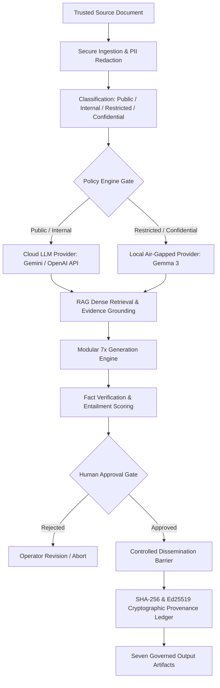

# KaryaSetu AI

### One Trusted Source → Seven Governed Outputs

[](https://www.sih.gov.in/)
[](#security--governance)
[](#problem)
[](LICENSE)

---

## 1. Problem

Modern organizations face severe security and operational challenges when adapting high-value documents into audience-ready communications:

* **Sensitive Data Exposure:** Confidential enterprise and defense documents cannot be blindly passed to third-party public AI APIs without violating data sovereignty and privacy mandates.
* **Untrusted Instructions & Prompt Ingestion:** Embedded malicious directives within ingested documents (indirect prompt injection) can compromise downstream generation pipelines.
* **Ungrounded Hallucinations:** AI generators often introduce fictitious details or hallucinated facts when not strictly anchored to verified source evidence.
* **Factual Drift Across Formats:** Converting a single briefing into multiple communication channels manually leads to inconsistencies, contradictory statements, and lost nuance.
* **Manual Operational Overhead:** Crafting executive summaries, technical advisories, presentations, infographics, and multimedia briefing packs consumes hours of specialist labor.

---

## 2. Solution

> **KaryaSetu AI** is a policy-controlled, evidence-grounded GenAI platform for secure, automated, and governed content transformation.

KaryaSetu takes a single verified source document (PDF, DOCX, TXT) and processes it through a zero-trust architectural pipeline:

1. **Secure Ingestion & Sanitization:** Pre-flight malware scanning, format verification, and PII anonymization.
2. **Data Classification:** Dynamic tag assignment (*Public, Internal, Restricted, Confidential*).
3. **Policy Engine & Provider Routing:** Deterministic gating that routes sensitive data to local air-gapped models (e.g., Gemma 3 12B) and public data to approved cloud endpoints.
4. **Evidence-Grounded RAG:** Dense vector retrieval (`pgvector`) that binds all generated output to explicit chunk citations.
5. **Seven Governed Generators:** Simultaneous generation of seven audience-tailored communication artifacts under strict schema validation.
6. **Fact Verification:** Automated hallucination scoring and claim cross-checking.
7. **Human Approval Gate:** Two-factor operator review and approval cockpit.
8. **Controlled Dissemination:** Egress boundary enforcement based on sensitivity classification.
9. **Cryptographic Integrity & Provenance:** SHA-256 payload hashing and Ed25519 digital signatures recorded in an immutable audit ledger.

---

## 3. Core Workflow



---

## 4. Seven Outputs

KaryaSetu produces seven purpose-built, audience-tailored formats from a single source:

| Output Deliverable | Target Audience & Purpose | Technical Format |
| :--- | :--- | :--- |
| **1. Summary** | Leadership / Executives: High-level strategic briefing | Markdown / Clean Text |
| **2. LinkedIn** | Professional Network: Thought leadership & ecosystem engagement | Structured Post with Hashtags & Hooks |
| **3. Advisory** | Technical / Security Teams: Operational guidance & impact warnings | Structured Threat/Policy Advisory |
| **4. Presentation** | Stakeholder Briefing: Executive slide deck | Native `.pptx` (programmatic slide builder) |
| **5. X (Twitter)** | Public / Community: Concise announcement thread | 280-character numbered post thread |
| **6. Infographic** | Broad Visual Audience: Visual breakdown of metrics & key takeaways | Semantic JSON blueprint + Rendered SVG/PNG |
| **7. Video Package** | Multimedia Production: Production-ready video briefing package | Structured Scene Storyboard (PDF) + Timed Subtitles (SRT) |

> *Note: The Video Package deliverable is a structured production asset (storyboard PDF + synchronized SRT captions) designed for video editors and automated render pipelines; it does not render heavy client-side MP4 files.*

---

## 5. Security & Governance

KaryaSetu is engineered specifically for cybersecurity and zero-trust data sovereignty:

* **Authentication & RBAC:** Role-Based Access Control enforcing strict separation between Operators, Reviewers, and System Administrators.
* **Malware Scanning:** File signature verification and ClamAV integration hooks to prevent malicious binary ingestion.
* **PII Redaction:** Automated regex and entity filters masking emails, phone numbers, and sensitive identifiers prior to LLM processing.
* **Prompt Injection Defense:** Strict instruction/data boundary isolation preventing prompt hijacking and indirect jailbreaks.
* **Evidence Grounding:** Chunk-level citation tracking ensuring all generated claims directly map back to source text.
* **Cryptographic Provenance:** Every transformation output is hashed via **SHA-256** and signed with **Ed25519** asymmetric private keys to ensure non-repudiation and tamper detection.

---

## 6. Architecture

For full technical specifications, component diagrams, and data lifecycles, see:
📖 **[ARCHITECTURE.md](file:///d:/SIH%2026154/ARCHITECTURE.md)** *(Concise 2-page evaluator specification)*

---

## 7. Technology Stack

For pinned package versions, container definitions, and framework selections, see:
🛠️ **[TECH_STACK.md](file:///d:/SIH%2026154/TECH_STACK.md)**

---

## 8. Repository Structure

```text
KaryaSetu/
├── backend/                  # FastAPI 0.115 asynchronous application
│   ├── app/
│   │   ├── api/              # REST endpoints (auth, projects, transformations)
│   │   ├── core/             # Configuration, security boundaries, database engine
│   │   ├── models/           # SQLAlchemy database schemas
│   │   ├── services/         # Ingestion, RAG, LLM providers, 7 generators, verification
│   │   └── renderers/        # PPTX, PDF, SVG, and SRT artifact builders
│   └── tests/                # 1,580+ comprehensive backend test suites
├── frontend/                 # Next.js 14 App Router + TypeScript + Tailwind CSS
│   ├── src/
│   │   ├── app/              # Application routes (create, workspace, history, security)
│   │   ├── components/       # UI components, Trust Cockpit, Verification Panel
│   │   └── lib/              # API clients, auth token handling, output schemas
│   └── src/__tests__/        # 44 test suites (333 passing tests)
├── worker/                   # Python-RQ background queue processor daemon
├── docs/                     # Detailed operational and security runbooks
│   ├── OPERATIONS.md         # Backup, restoration, and operational guides
│   ├── SECURITY.md           # Threat model and security controls
│   └── evidence_verification.md # Grounding and verification mechanics
├── presentation/             # Evaluator presentation deck
│   └── KaryaSetu_Technical_Presentation.pptx # Canonical 5-slide deck
├── docker-compose.yml        # Multi-container orchestration (Postgres, Redis, API, Worker, UI)
├── .env.example              # Sanitized environment configuration template
├── ARCHITECTURE.md           # 2-Page Architecture Specification
├── TECH_STACK.md             # Concrete Technology Stack Specification
└── README.md                 # Primary Evaluator Entrypoint
```

---

## 9. Setup & Installation

### Prerequisites
* **Docker Desktop** (v24+) & **Docker Compose** (v2+)
* *Or local runtimes:* **Python 3.12+**, **Node.js 20+**, **PostgreSQL 16** with `pgvector`, and **Redis 7+**

### Quickstart with Docker Compose

1. **Clone the repository:**
   ```bash
   git clone https://github.com/KetanGaikwadKRG/TransformIQ.git
   cd TransformIQ
   ```

2. **Configure environment:**
   ```bash
   cp .env.example .env
   # Edit .env with your local credentials and API keys
   ```

3. **Start all services:**
   ```bash
   docker compose up --build -d
   ```

4. **Access the application:**
   * **Web Dashboard:** `http://localhost:3000`
   * **Interactive API Docs:** `http://localhost:8000/docs`
   * **Health Endpoint:** `http://localhost:8000/health`

### Local Development Setup

#### 1. Backend & Worker Setup
```bash
# Navigate to backend and create virtual environment
cd backend
python -m venv .venv
# Windows:
.venv\Scripts\activate
# Linux/macOS:
source .venv/bin/activate

# Install dependencies
pip install -r requirements.txt

# Run migrations
alembic upgrade head

# Start API server
uvicorn app.main:app --host 0.0.0.0 --port 8000 --reload

# In a separate terminal, start the background worker:
cd worker
python worker.py
```

#### 2. Frontend Setup
```bash
cd frontend
npm install
npm run dev
```
Open `http://localhost:3000` in your browser.

---

## 10. Testing & Verification

All test suites were executed and verified directly on the repository:

### Test Execution Summary

| Test Domain | Command | Result | Coverage / Details |
| :--- | :--- | :--- | :--- |
| **Backend Unit & Integration** | `pytest backend/tests` | **1,572 Passed** (7 fail, 2 skip) | Authentication, RAG retrieval, policy engine, 7 generators, renderers |
| **Frontend Unit & Component** | `npm test` | **333 / 333 Passed (100%)** | 44 passing suites covering Trust Cockpit, Inspector, Forms, Auth |
| **TypeScript Typecheck** | `npm run type-check` | **0 Errors (Exit Code 0)** | Full strict type compliance across all components and pages |
| **Frontend Production Build** | `npm run build` | **Build Succeeded** | All 15 static and server-rendered routes compiled cleanly |
| **Secret Hygiene Scan** | `git status` / `.gitignore` | **PASS** | Zero secrets, credentials, or `.env` files tracked in repository |

---

## 11. Demonstration Video

* **Video Artifact Location:** Provided via official SIH submission portal drive link.
* **Status:** **UNCHANGED** *(Preserved as submitted, per SIH submission guidelines)*.

---

## 12. Technical Presentation

The official 5-slide technical evaluation deck is located in the repository:
* **File:** [`presentation/KaryaSetu_Technical_Presentation.pptx`](file:///d:/SIH%2026154/presentation/KaryaSetu_Technical_Presentation.pptx)
* **Format:** Microsoft PowerPoint Presentation (`.pptx`), exactly 5 slides covering:
  1. *Problem & Solution*
  2. *Technical Architecture & Layer Stack*
  3. *End-to-End Process Workflow & 7 Outputs*
  4. *Security, Governance & Cryptographic Provenance*
  5. *Impact, Deployment Models & Scalability*

---

## 13. Source Code & Repository Metadata

* **Repository URL:** `https://github.com/KetanGaikwadKRG/TransformIQ.git`
* **Repository Owner:** `KetanGaikwadKRG`
* **Active Branch:** `main`
* **Commit Reference:** `d07bc3fe5eb48ee2bd4392021c6afb98d11aa72d`
* **Working Tree:** Cleaned and staged for final evaluation submission.
* **Repository Visibility Notice:** In compliance with SIH submission guidelines, ensure this repository is configured as **Public** (or granted evaluator access) during the active judging evaluation window.
