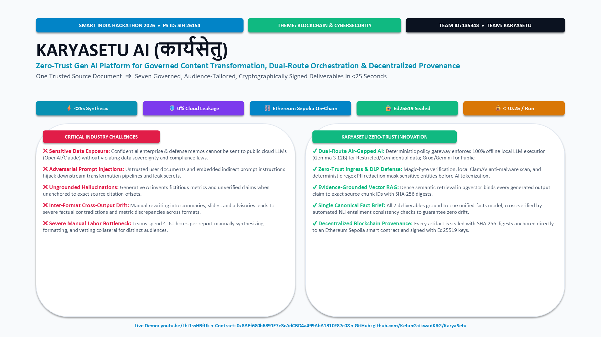
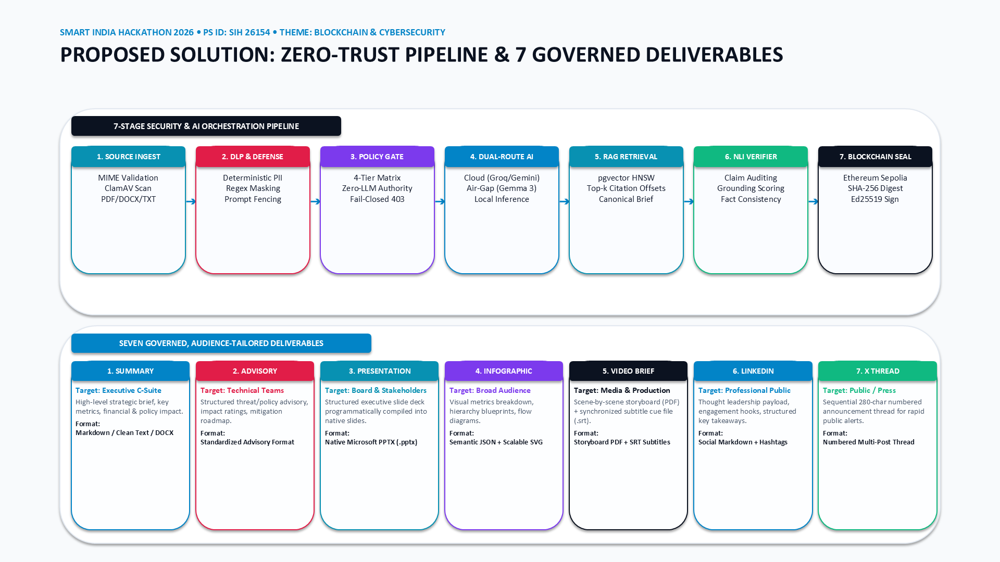
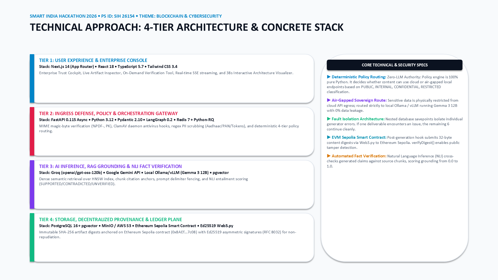
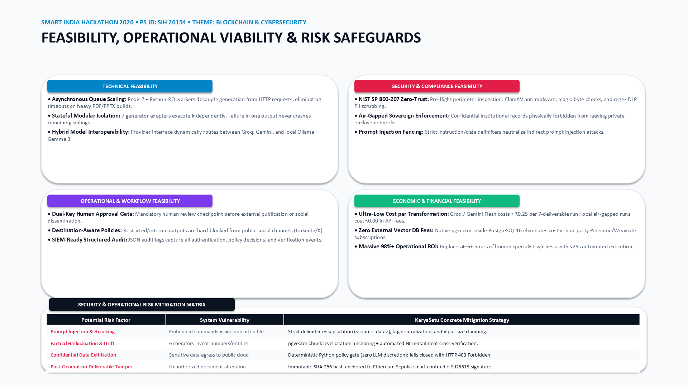
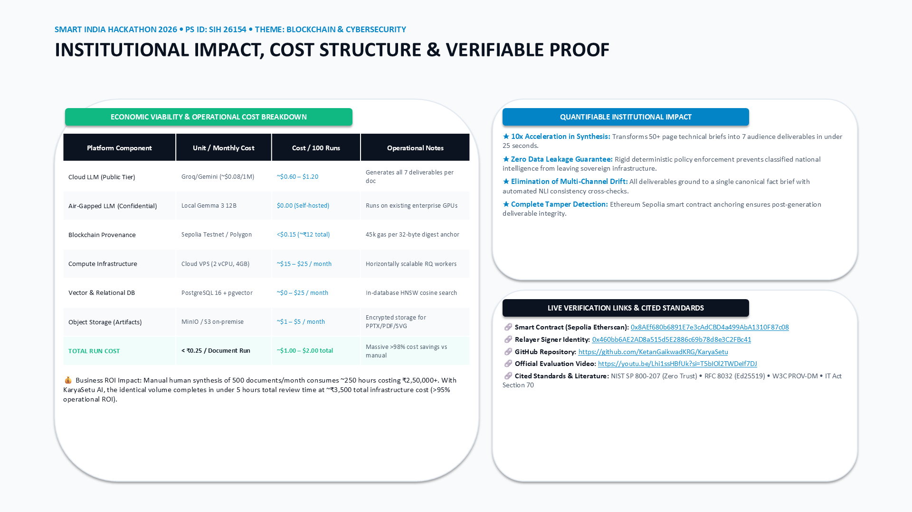

# KaryaSetu AI — Technical Presentation (SIH 2026)

> **Smart India Hackathon 2026 • Problem Statement ID: SIH 26154**
> **Theme:** Blockchain & CyberSecurity | **Category:** Software
> **Team ID:** 135343 | **Team Name:** KaryaSetu

This directory contains the canonical 5-slide technical evaluation presentation for KaryaSetu AI, available in both **PowerPoint (`.pptx`)** and **Print-Ready PDF (`.pdf`)** formats.

* 📥 **[Download PowerPoint Deck (.pptx)](./KaryaSetu_Technical_Presentation.pptx)**
* 📄 **[View Full Presentation (.pdf)](./KaryaSetu_Technical_Presentation.pdf)**
* 🐍 **[Slide Generator Script](../scripts/generate_presentation.py)**

---

## 🖼️ High-Resolution Slide Previews

### Slide 1 — Problem Statement, Team Details & Core Proposition

* **Key Focus:** Highlights SIH 26154 problem statement, team identity (ID 135343), 5 primary metric callout pills (`<25s Synthesis`, `0% Cloud Leakage`, `Sepolia On-Chain`, `Ed25519 Sealed`, `<₹0.25/Run`), side-by-side comparison of critical industry challenges vs. KaryaSetu zero-trust innovations, and verifiable live links.

---

### Slide 2 — Proposed Solution: 7-Stage Pipeline & 7 Governed Deliverables

* **Key Focus:** Visual 7-stage connected flowchart (`Source Ingest` ➔ `DLP & Defense` ➔ `Policy Gate` ➔ `Dual-Route AI` ➔ `RAG Retrieval` ➔ `NLI Verifier` ➔ `Blockchain Seal`), paired with detailed visual cards for all 7 audience-tailored deliverables (Executive Summary, Advisory, Slide Deck, Infographic, Video Storyboard+SRT, LinkedIn Post, and X Press Thread).

---

### Slide 3 — Technical Approach: 4-Tier Architecture & Deep Tech Stack

* **Key Focus:** 4 stacked architecture tiers with colored visual accents (Next.js 14 console, FastAPI 0.115 security gateway, AI/RAG inference with Groq/Gemini/Gemma 3, and PostgreSQL/MinIO/Sepolia Web3 persistence plane) alongside deep-dive engineering highlights.

---

### Slide 4 — Feasibility, Operational Viability & Risk Safeguards

* **Key Focus:** 4-pillar feasibility matrix (Technical, Security & Compliance, Operational, and Economic) accompanied by an itemized Risk vs. Concrete Codebase Mitigation Strategy table.

---

### Slide 5 — Institutional Impact, Cost Structure & Verifiable Proof

* **Key Focus:** Complete itemized economic cost breakdown (< ₹0.25 per run; >98% OpEx reduction), business ROI impact callout, quantifiable institutional impact stars, and clickable live proof links (Sepolia Etherscan contract, relayer wallet, YouTube demo video, GitHub repo, and cited regulatory standards).
